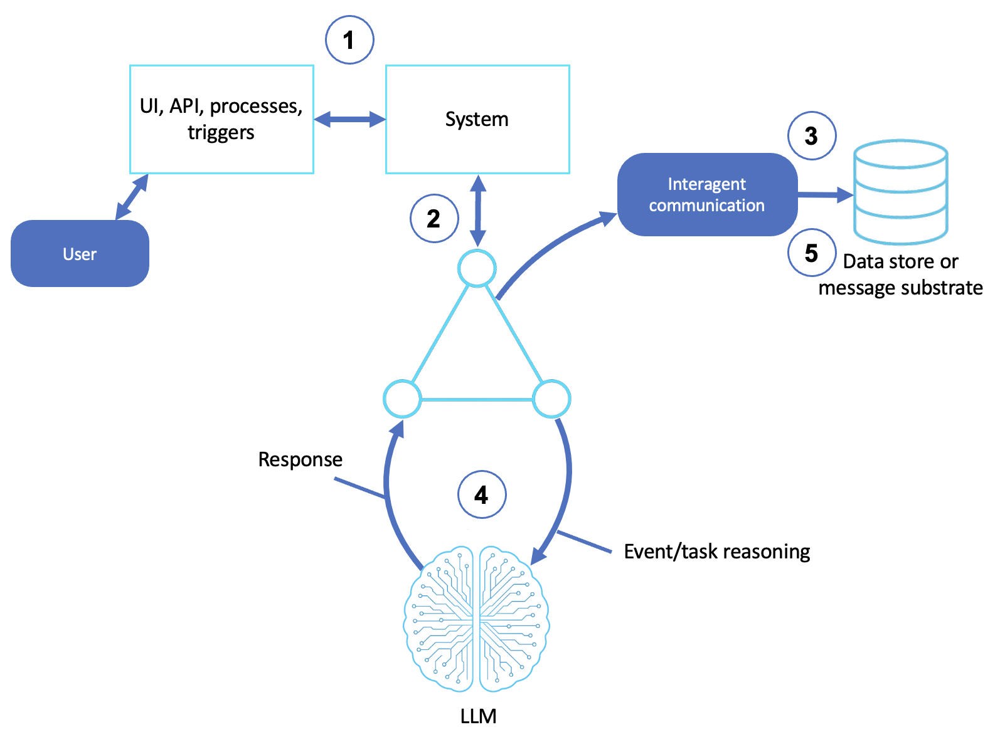

# Multi-Agent Collaboration

Multiple autonomous agents, each with a distinct role or specialization, coordinating as peers to solve a problem.

This sample builds peer-collaboration patterns with the [Strands Agents SDK](https://strandsagents.com/) and is based off of the [AWS Prescriptive Guidance - Multi-agent collaboration pattern](https://docs.aws.amazon.com/prescriptive-guidance/latest/agentic-ai-patterns/multi-agent-collaboration.html).

## Table of Contents

- [Quick Start](#quick-start)
- [Collaboration Patterns](#collaboration-patterns)
  - [How It Works](#how-it-works)
  - [How This Differs From Workflow Orchestration](#how-this-differs-from-workflow-orchestration)
  - [Swarm Handoff](#swarm-handoff)
  - [Agents as Tools](#agents-as-tools)
  - [Debate](#debate)
- [AWS Implementation Patterns](#aws-implementation-patterns)
- [Reference](#reference)

## Quick Start

**Prerequisites:**
- Python 3.10+
- An AWS account with Amazon Bedrock access
- AWS credentials configured (`aws configure`) with permission to invoke models on Bedrock

```bash
# Create and activate virtual environment
python3 -m venv venv
source venv/bin/activate  # On Windows: venv\Scripts\activate

# Install dependencies
pip install -r requirements.txt

# Point the sample at your AWS profile and region (loaded by shared/model.py)
cp .env.example .env
# Edit .env: set AWS_PROFILE and AWS_REGION. Optionally pin a model with STRANDS_MODEL_ID.

# Run any of the three collaboration patterns
python swarm_handoff.py      # peer specialists hand off by domain
python agents_as_tools.py    # an orchestrator consults specialists as tools
python debate_agents.py      # a proposer and critic iterate to a better answer
```

> **Note:** Multi-agent systems cost more in both tokens and time to reason. Each agent in this sample is created with a **shared `BedrockModel`** instance to reduce spin up times.

**Try these exercises:**
1. **Watch a handoff chain.** Use the swarm handoff to answer a question spanning multiple domains (e.g., "store Bedrock outputs in Amazon DynamoDB") and watch specialists defer to each other.
2. **See selective consultation.** With agents as tools, ask a purely technical question, then a cross-domain business one, and note how many specialists the orchestrator consults each time.
3. **Follow a debate.** Experiment with the debate agents and read how the critic's feedback changes the proposer's answer across rounds.
4. **Find the decomposition seam.** Pick a task and decide whether to split it by *role* or by *context boundary*.

---

## Collaboration Patterns

In multi-agent collaboration, agents act as **peers**. Each agent communicates and adapts based on reasoning provided by its peers. This sample shows three patterns: peer handoff with an **agent swarm**, an orchestrator using **agents as tools**, and a proposer/critic **debate agent**.

### How It Works

1. **Initiates a task**: a user or system emits a high-level goal; a manager agent or initiating context defines the objective
2. **Assigns or discovers roles**: agents self-assign or are delegated to roles such as planner, researcher, executor, critic, and explainer
3. **Communicates with other agents**: agents talk through shared memory, message queues, and prompt chaining
4. **Uses specialized reasoning**: each agent applies its own model or domain logic with role-specific prompts and memory
5. **Coordinates outputs or goals**: agents synthesize contributions into a final answer; optionally a supervising agent validates or summarizes



### How This Differs From Workflow Orchestration

[Sample 07](https://github.com/aws-samples/sample-workflow-orchestration-agent) coordinated agents through a **central controller** running a predefined plan. Multi-agent collaboration is **peer-to-peer**: agents coordinate among themselves, and the path through them emerges from the problem rather than a fixed sequence.

| | Workflow orchestration (Sample 07) | Multi-agent collaboration (Sample 11) |
|---|---|---|
| Control | Centralized coordinator | Decentralized, role-based peers |
| Interaction | One agent delegates and tracks | Agents negotiate, share, and adapt |
| Design | Predefined sequence of tasks | Emergent, flexible task distribution |
| Best for | Enterprise process automation | Open-ended reasoning and exploration |

### Swarm Handoff

The [swarm handoff](swarm_handoff.py) uses the Strands [`Swarm`](https://strandsagents.com/docs/user-guide/sdk/multi-agent/swarm/) primitive: peer specialists that **hand off** to each other based on what the question needs. There is no central router and each agent answers its part and defers the rest:

```python
from strands.multiagent import Swarm

swarm = Swarm([infra_specialist, compute_specialist, database_specialist])
# the handoff chain emerges from the question's domain demands
```

Use a swarm when each specialist holds factually distinct knowledge and the path through them depends on the question. Split agents by what they know (domain), not by what they do (role).
### Agents as Tools

The [agents-as-tools example](agents_as_tools.py) wraps specialist agents as `@tool` functions an orchestrator can call. The orchestrator **discovers** which experts to consult mid-reasoning — a pure technical question might consult one specialist, a complex business decision all three:

```python
@tool
def consult_legal(question: str) -> str:
    """Consult the legal specialist for contract and compliance questions."""
    return str(_AGENTS["legal"](question))

orchestrator = Agent(system_prompt=PRIMARY_PROMPT, tools=[consult_legal, consult_financial, consult_technical])
```

This is the collaboration cousin of [Sample 07's conditional router](https://github.com/aws-samples/sample-workflow-orchestration-agent): the router picks *one* path up front, while the orchestrator can consult *several* specialists dynamically as reasoning unfolds.

### Debate

The [debate agents](debate_agents.py) pit a **proposer** against a **critic** across rounds: the proposer offers a solution, the critic challenges it, and they iterate until they converge or hit a round limit. The back-and-forth surfaces flaws a single pass would miss:

```python
# proposer drafts -> critic challenges -> proposer revises -> ... until convergence
```

Use debate for self-correction and reflective refinement. The adversarial pressure produces a better answer than one agent reasoning alone.

---

## AWS Implementation Patterns

| Pattern | Description | Reference |
|---------|-------------|-----------|
| Collaboration patterns with Strands | Multi-agent collaboration patterns using Strands Agents and Amazon Nova | [Multi-agent collaboration patterns with Strands Agents and Amazon Nova](https://aws.amazon.com/blogs/machine-learning/multi-agent-collaboration-patterns-with-strands-agents-and-amazon-nova/) |
| Complex problem solving | Unlock complex problem-solving with multi-agent collaboration on Amazon Bedrock | [Unlocking complex problem solving with multi-agent collaboration on Amazon Bedrock](https://aws.amazon.com/blogs/machine-learning/unlocking-complex-problem-solving-with-multi-agent-collaboration-on-amazon-bedrock/) |
| Serverless multi-agent systems | Build highly scalable serverless multi-agent systems on AWS with Amazon Bedrock AgentCore | [Build highly scalable serverless LangGraph multi-agent systems in AWS with Amazon Bedrock AgentCore](https://aws.amazon.com/blogs/machine-learning/build-highly-scalable-serverless-langgraph-multi-agent-systems-in-aws-with-amazon-bedrock-agentcore/) |
| Industry multi-agent collaboration | Multi-agent collaboration for telecom network operations on Amazon Bedrock | [Multi-agent collaboration using Amazon Bedrock for telecom network operations](https://aws.amazon.com/blogs/industries/multi-agent-collaboration-using-amazon-bedrock-for-telecom-network-operations/) |

## Reference

- [Companion blog post: When Multi-Agent Collaboration Earns Its Cost](When%20Multi-Agent%20Collaboration%20Earns%20Its%20Cost.md)
- [AWS Prescriptive Guidance - Multi-agent collaboration](https://docs.aws.amazon.com/prescriptive-guidance/latest/agentic-ai-patterns/multi-agent-collaboration.html)
- [Strands multi-agent: Swarm](https://strandsagents.com/docs/user-guide/sdk/multi-agent/swarm/)
- [Strands multi-agent: Agents as Tools](https://strandsagents.com/docs/user-guide/sdk/multi-agent/agents-as-tools/)
- [Amazon Bedrock User Guide](https://docs.aws.amazon.com/bedrock/latest/userguide/what-is-bedrock.html)

### The series

This sample is one of eleven, one per pattern in the [AWS Prescriptive Guidance on agentic AI patterns](https://docs.aws.amazon.com/prescriptive-guidance/latest/agentic-ai-patterns/). Each has a hands-on sample repository and a companion blog post explaining the concepts.

| # | Pattern | Sample | Blog |
|---|---|---|---|
| 01 | Basic Reasoning Agents | [sample-basic-reasoning-agents](https://github.com/aws-samples/sample-basic-reasoning-agents) | [Building Basic Reasoning Agents with Amazon Bedrock and Strands SDK](https://github.com/aws-samples/sample-basic-reasoning-agents/blob/main/Building%20Basic%20Reasoning%20Agents%20with%20Amazon%20Bedrock%20and%20Strands%20SDK.md) |
| 02 | Tool-Based Agents (Functions) | [sample-tool-based-agents-functions](https://github.com/aws-samples/sample-tool-based-agents-functions) | [Extending AI Agents with Custom Tools and Functions](https://github.com/aws-samples/sample-tool-based-agents-functions/blob/main/Extending%20AI%20Agents%20with%20Custom%20Tools%20and%20Functions.md) |
| 03 | Tool-Based Agents (Servers) | [sample-tool-based-agents-servers](https://github.com/aws-samples/sample-tool-based-agents-servers) | [Delegating Work: Tool Servers and the Model Context Protocol](https://github.com/aws-samples/sample-tool-based-agents-servers/blob/main/Delegating%20Work%20-%20Tool%20Servers%20and%20the%20Model%20Context%20Protocol.md) |
| 04 | Computer-Use Agents | [sample-computer-use-agents](https://github.com/aws-samples/sample-computer-use-agents) | [Agents That Use Computers: Browsers, Desktops, and the GUI Frontier](https://github.com/aws-samples/sample-computer-use-agents/blob/main/Agents%20That%20Use%20Computers%20-%20Browsers%2C%20Desktops%2C%20and%20the%20GUI%20Frontier.md) |
| 05 | Coding Agents | [sample-coding-agents](https://github.com/aws-samples/sample-coding-agents) | [Coding Agents: From Autocomplete to Autonomous Software Work](https://github.com/aws-samples/sample-coding-agents/blob/main/Coding%20Agents%20-%20From%20Autocomplete%20to%20Autonomous%20Software%20Work.md) |
| 06 | Speech and Voice Agents | [sample-speech-voice-agents](https://github.com/aws-samples/sample-speech-voice-agents) | [Giving Agents a Voice: Speech-to-Speech and the STT/TTS Pipeline](https://github.com/aws-samples/sample-speech-voice-agents/blob/main/Giving%20Agents%20a%20Voice%20-%20Speech-to-Speech%20and%20the%20STT-TTS%20Pipeline.md) |
| 07 | Workflow Orchestration Agents | [sample-workflow-orchestration-agent](https://github.com/aws-samples/sample-workflow-orchestration-agent) | [Orchestrating Agents: Sequential, Parallel, and Conditional Workflows](https://github.com/aws-samples/sample-workflow-orchestration-agent/blob/main/Orchestrating%20Agents%20-%20Sequential%2C%20Parallel%2C%20and%20Conditional%20Workflows.md) |
| 08 | Memory-Augmented Agents | [sample-memory-augmented-agents](https://github.com/aws-samples/sample-memory-augmented-agents) | [Agents That Remember: Context Windows, Summaries, and Persistent Sessions](https://github.com/aws-samples/sample-memory-augmented-agents/blob/main/Agents%20That%20Remember%20-%20Context%20Windows%2C%20Summaries%2C%20and%20Persistent%20Sessions.md) |
| 09 | Simulation and Test-Bed Agents | [sample-simulation-testbed-agents](https://github.com/aws-samples/sample-simulation-testbed-agents) | [Practice Worlds: Simulation and Test-Bed Agents](https://github.com/aws-samples/sample-simulation-testbed-agents/blob/main/Practice%20Worlds%20-%20Simulation%20and%20Test-Bed%20Agents.md) |
| 10 | Observer and Monitoring Agents | [sample-observer-monitoring-agents](https://github.com/aws-samples/sample-observer-monitoring-agents) | [Watching the Watched: Observer and Monitoring Agents](https://github.com/aws-samples/sample-observer-monitoring-agents/blob/main/Watching%20the%20Watched%20-%20Observer%20and%20Monitoring%20Agents.md) |
| 11 | Multi-Agent Collaboration | this repository | [When Multi-Agent Collaboration Earns Its Cost](When%20Multi-Agent%20Collaboration%20Earns%20Its%20Cost.md) |

## Security

See [CONTRIBUTING](CONTRIBUTING.md#security-issue-notifications) for more information.

## License

This library is licensed under the MIT-0 License. See the LICENSE file.
